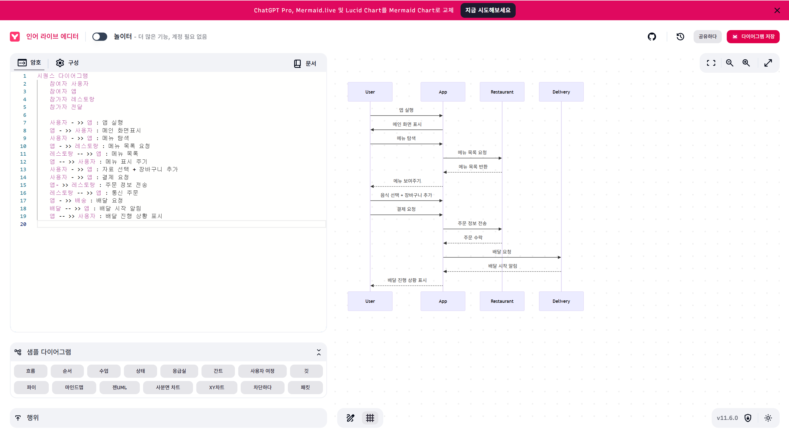

# food-delivery-sequence-sample
일상 속 소프트웨어 사용 사례 중 하나인 **음식 배달 앱**을 주제로  
시퀀스 다이어그램을 모델링하고, 이를 기반으로 Python 코드를 모듈 단위로 구현하였습니다.  
본 프로젝트는 실생활에서 많이 사용되는 프로세스를 소프트웨어 관점에서 분석하고 구성하는 데에 중점을 두었습니다.

# 시퀀스 다이어그램

아래는 Mermaid.live를 사용하여 작성한 시퀀스 다이어그램입니다.  
**사용자 → 앱 → 음식점 → 배달 시스템** 간의 메시지 흐름을 표현했습니다.




## 모듈 평가

### 응집도(Cohesion)
각 모듈은 단일 책임을 가집니다:
- `restaurant.py`: 메뉴 제공 및 주문 수락
- `delivery.py`: 배달 시작 처리
- `payment.py`: 결제 처리
→ 높은 응집도를 유지하여 각 모듈의 명확한 역할 분리가 가능합니다.

### 결합도(Coupling)
모든 모듈은 `app.py`에서 조정되며, 직접 서로를 참조하지 않습니다.
→ 낮은 결합도를 유지하여 변경 및 유지보수에 유리합니다.

## ▶ 실행 방법

Python이 설치된 환경에서 아래 명령어로 실행합니다:

```bash
python main.py

